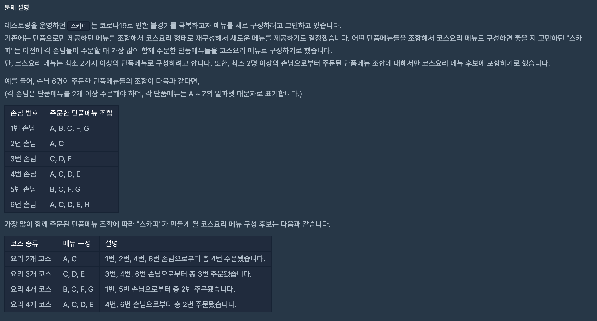
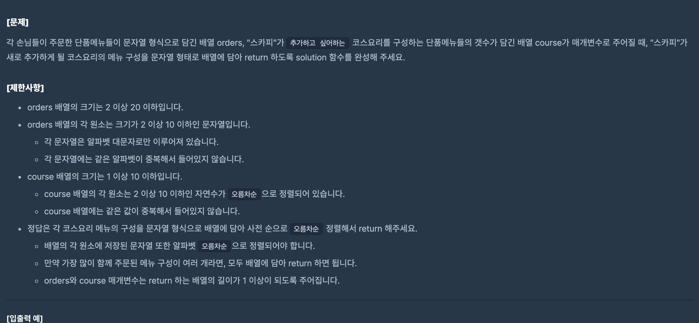

https://programmers.co.kr/learn/courses/30/lessons/72411

### 문제 설명

> 모두 가능한 코스에서 **가장 큰 주문을 한** 코스들만 출력하는 것이다.
> 모두 가능한 코스만 선별 or orders에 값들로 만드는 것이라고 착각하고 문제를 잘못 풀었다.

### 문제 풀이

- course 배열의 크기는 1 이상 10 이하이기 때문에 모든 경우를 다 탐색하는 부르트 포스트 방식 사용 가능하다.
- 조합으로 가능한 코스들을 뽑아낸다.

1.  손님이 주문한 주문한 단품메뉴 알파벳을 저장한다.
2.  course만큼 재귀를 돌린다.
    - 조합의 방식으로 course의 길이 만큼 코스를 만든다.
    - 만들어진 코스들이 orders에 포함 되는지 확인한다.
      - 만일 **모두** 포함된다면, 카운팅한다.
    - 카운팅 한 값(즉 다른 코스에 얼마나 포함되는 지 여부)이 본인을 제외하고 1회 이상 포함 되면 저장한다.
3.  저장된 코스들 값을 course를 기준으로 최대로 orders에 포함된 값만 출력한다.
