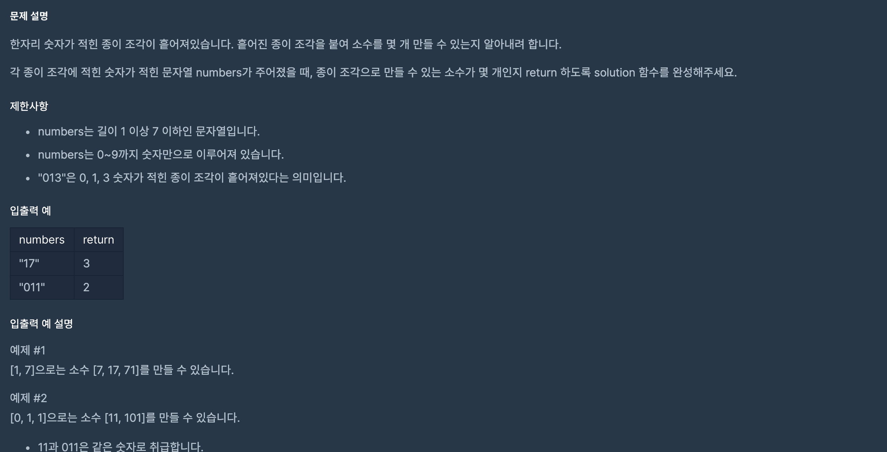

https://programmers.co.kr/learn/courses/30/lessons/42839

### 문제 설명

### 문제 풀이

1. 재귀를 통해 순열의 모든 경우를 다 구할 수한다.

   - vistied로 이미 한번 사용된 문자에 대해서는 체킹한다.
     - 똑같은 인덱스에 숫자 반복하지 않게 확인하는 작엄

2. 완성된 숫자에 대해 **소수인지 탐색(아리스토체 방식)** 한다

   - 이때, 1과 0에(문자열이 0으로 시작할 때) 대해서는 예외 처리해준다.

3. 소수라면 해당 문자가 이미 만들어진 것인지 확인한다.
   - 만들어 지지 않았다면 카운팅하고 배열에 소수를 추가한다.
     - 똑같은 숫자가 여러개 일 경우 같은 숫자가 여러번 만들어 질 수 도 있기 때문
