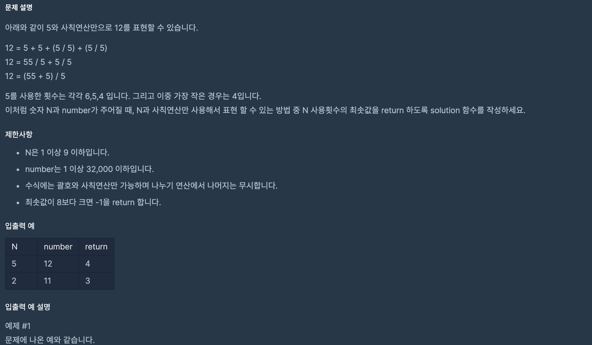

https://programmers.co.kr/learn/courses/30/lessons/12973

### 문제 설명

### 문제 풀이

- 핵심은 N,NN,NNNN을 8자리수 까지 만든 후에 사칙연산 해야 한다는 것

##### 재귀 방식 풀이

1.  8이상 반복할 수 없기 때문에 재귀의 방식을 사용하여 사칙연산을 해줄 수 있다.

##### 동적 계획 법 풀이

1. 인덱스에 1~8까지 자릿 수 숫자를 미리 만든다. ex) num[2]=55

2. 1~8까지 반복하여 i만큼 N을 사용하여 만든 dp[i]를 구해나간다.(동적 프로그래밍)
   - m자 릿 수의 숫자와 사칙 연산을 한다고 가정 했을 때
     - num[m] 와 dp[i-m]배열 숫자를 사칙연산(+,-,\*,/)하여 dp[i] 배열에 추가한다.
     - 메모이제이션을 활용하여 계산해 나간다.

> 틀린 이유:
>
> - 8번 사칙연산하여 N을 추가하는 DP 문제라고 잘못 풀었다.
> - 55 5555와 같은 숫자를 만들어서 넣을 생각을 못했다..
> - N이 0~9제한이고 NN,NNNN 와 같이 자리수가 늘어나는 방식은 temp = temp \* 10 + N 와 같은 사용하면 편하다.
