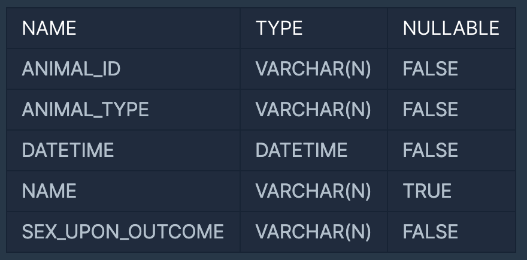

https://programmers.co.kr/learn/courses/30/lessons/59042

#### 문제 설명
- ANIMAL_INS 테이블은 동물 보호소에 들어온 동물의 정보를 담은 테이블입니다. 
- ANIMAL_INS 테이블 구조는 다음과 같으며, ANIMAL_ID, ANIMAL_TYPE, DATETIME, INTAKE_CONDITION, NAME, SEX_UPON_INTAKE는 각각 동물의 아이디, 생물 종, 보호 시작일, 보호 시작 시 상태, 이름, 성별 및 중성화 여부를 나타냅니다.
- 

- ANIMAL_OUTS 테이블은 동물 보호소에서 입양 보낸 동물의 정보를 담은 테이블입니다. 
- ANIMAL_OUTS 테이블 구조는 다음과 같으며, ANIMAL_ID, ANIMAL_TYPE, DATETIME, NAME, SEX_UPON_OUTCOME는 각각 동물의 아이디, 생물 종, 입양일, 이름, 성별 및 중성화 여부를 나타냅니다. ANIMAL_OUTS 테이블의 ANIMAL_ID는 ANIMAL_INS의 ANIMAL_ID의 외래 키입니다.
-  

- 입양기록은 있는데, 들어온 기록이 없는 동물의 ID와 이름을 ID순으로 조회하는 SQL문을 작성하시오.
#### 문제 풀이
1. OUT을 기준으로 LEFT_JOIN을 진행한다. 
2. 조건에 ANIMAL_INS IS NULL을 추가한다.
3. ANIMAL_ID를 ASC로 정렬한다.

