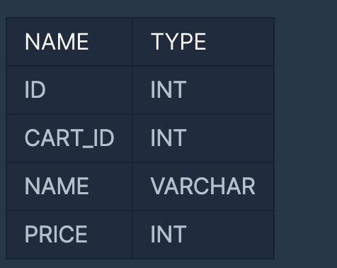

https://programmers.co.kr/learn/courses/30/lessons/59047
#### 문제 설명
- ACART_PRODUCTS 테이블은 장바구니에 담긴 상품 정보를 담은 테이블입니다. 
- CART_PRODUCTS 테이블의 구조는 다음과 같으며, ID, CART_ID, NAME, PRICE는 각각 테이블의 아이디, 장바구니의 아이디, 상품 종류, 가격을 나타냅니다.
- 
- 우유와 요거트를 동시에 구입한 장바구니의 아이디를 조회하는 SQL 문을 작성해주세요. 
- 이때 결과는 장바구니의 아이디 순으로 나와야 합니다.

#### 문제 풀이
1. NAME='Milk'인 ID값 을 뽑은 뒤에(서브쿼리를 이용한다.)
2. NAME='Yogurt인 ID를 뽑는다.
3. 순서는 ID를 기준으로 오름차순 정렬한다.
