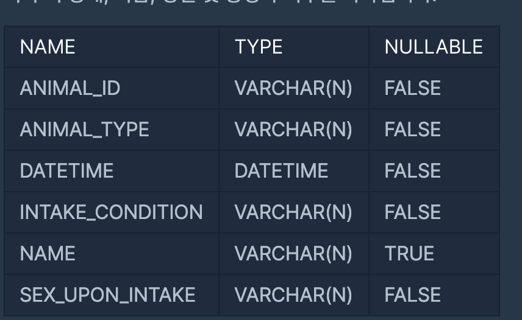

https://programmers.co.kr/learn/courses/30/lessons/59043
#### 문제 설명
- ANIMAL_INS 테이블은 동물 보호소에 들어온 동물의 정보를 담은 테이블입니다. 
- ANIMAL_INS 테이블 구조는 다음과 같으며, ANIMAL_ID, ANIMAL_TYPE, DATETIME, INTAKE_CONDITION, NAME, SEX_UPON_INTAKE는 각각 동물의 아이디, 생물 종, 보호 시작일, 보호 시작 시 상태, 이름, 성별 및 중성화 여부를 나타냅니다.
- 

- ANIMAL_OUTS 테이블은 동물 보호소에서 입양 보낸 동물의 정보를 담은 테이블입니다. 
- ANIMAL_OUTS 테이블 구조는 다음과 같으며, ANIMAL_ID, ANIMAL_TYPE, DATETIME, NAME, SEX_UPON_OUTCOME는 각각 동물의 아이디, 생물 종, 입양일, 이름, 성별 및 중성화 여부를 나타냅니다. ANIMAL_OUTS 테이블의 ANIMAL_ID는 ANIMAL_INS의 ANIMAL_ID의 외래 키입니다.
-  
- 보호시작일 보다 입양일이 더 빠른 동물의 아이디와 이름을 조회 하는 SQL문을 작성하시오. 이때 보호 시작일이 빠른 순으로 조회하시오.

#### 문제 풀이
1. OUT을 기준으로 INNER_JOIN을 진행한다. 
2. ANIMAL_OUTS.DATETIME >ANIMAL_INS.DATETIME일 일시에 조건을 건다.

