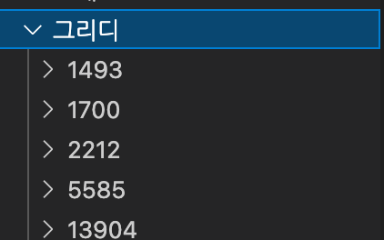
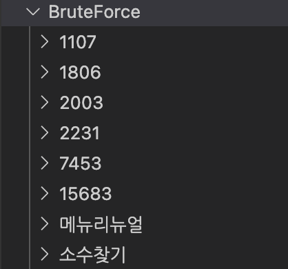

### 📝 알고리즘 파일 설명

📂 이름 **숫자** 인 경우:[백준](https://www.acmicpc.net/) 문제 풀이
📂 이름 **이름** 인 경우:[프로그래머스](https://programmers.co.kr/learn/challenges) 문제 풀이

   

> **그리디**로 분류된 [백준](https://www.acmicpc.net/) 문제 (1493),(1700),(2212)..번 문제 풀이

   

> **브루트 포스트**로 분류된 [백준](https://www.acmicpc.net/) 문제 (1107),(1806).., [프로그래머스](https://programmers.co.kr/learn/challenges) (메뉴리뉴얼),(소수찾기) 문제 풀이
