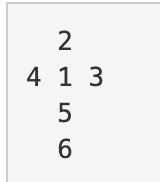

https://www.acmicpc.net/problem/14499

### 문제 풀이

- 세로 크기 N, 가로 크기 M (1 ≤ N, M ≤ 20)의 지도
- 주사위를 놓은 곳의 좌표 x y(0 ≤ x ≤ N-1, 0 ≤ y ≤ M-1), 그리고 명령의 개수 K (1 ≤ K ≤ 1,000)가 주어진다.
- 이 지도의 위에 주사위가 하나 놓여져 있으며, 주사위의 전개도는 아래와 같다.
  

- 가장 처음에 주사위에는 모든 면에 0이 적혀져 있다.

- 지도의 각 칸에는 정수가 하나씩 쓰여져 있다. 주사위를 굴렸을 때, 이동한 칸에 쓰여 있는 수가 0이면, 주사위의 바닥면에 쓰여 있는 수가 칸에 복사된다. 0이 아닌 경우에는 칸에 쓰여 있는 수가 주사위의 바닥면으로 복사되며, 칸에 쓰여 있는 수는 0이 된다.

- 이동할 때마다 주사위의 윗 면에 쓰여 있는 수를 출력한다. 만약 바깥으로 이동시키려고 하는 경우에는 해당 명령을 무시해야 하며, 출력도 하면 안 된다.

#### 순서

1. 이동 하는 칸이 유효한 칸인지 확인한다.
2. 유효한 칸이라면 주사위 숫자들이 어떤 칸으로 이동할 것인지를 체크한다.
3. 이동 된 칸에 윗면의 쓰인 수를 출력한다.
4. 이동한 칸의 숫자에 따라 다른 전략을 취한다.
   ~~아래 숫자와 지도의 칸의 숫자를 바꾼다.~~

- 이동한 칸의 숫자 가 있을 때 는 주사위로 복사하고 해당 칸 0으로 수정
- 없을 시에는 주사위의 값을 해당 칸으로 수정

5. 이동한 칸을 업데이트 한다.
