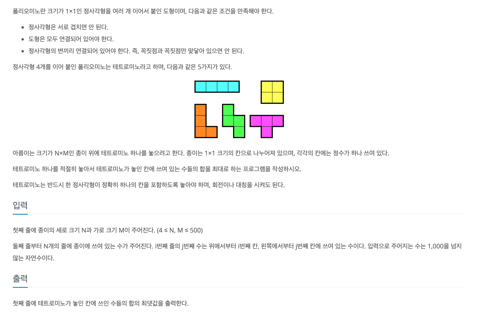

https://www.acmicpc.net/problem/14500

### 문제 설명

### 문제 풀이

- 대칭 및 회전을 통해 만들 수 있는 모양의 종류는 다음과 같다.

- 세로 크기 N과 가로 크기 M (4 ≤ N, M ≤ 500)이고 가능한 모양은 19개 이다.

- 따라서, 시간 복잡도는 O(N*M*19)로 모든 시뮬레이션을 구현하기에 충분한 시간이다.

> 본인은 1,2,3,4,5번 모양을 각각 함수로 만들어서 풀이했는데 이는 실수를 많이 유발했다. **특히 5번**
> 이런 경우는 그냥 배열로 모두 만들어준 뒤에 순차적으로 도는 것도 나쁘지 않다.
