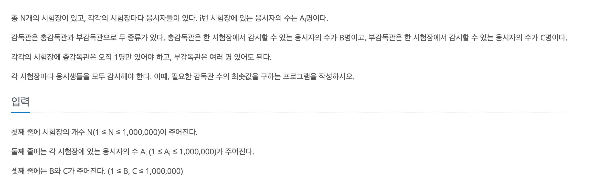

https://www.acmicpc.net/problem/13458

### 문제설명

### 문제 풀이

- 모든 시험 장은 각각 관리한다.
- 총 감독관은 **필수적**으로 들어가야한다.
- 먼저 총 감독관 먼저 배치한다.(총 감독관으로 해결 되면 다름 시험장으로 넘어간다.)
- 부 감독관을 배치한다.(Ai/c)만큼 추가해준다.
- 만일 (Ai/c)로도 해결이 되지 않으면 +1을 해준다.
