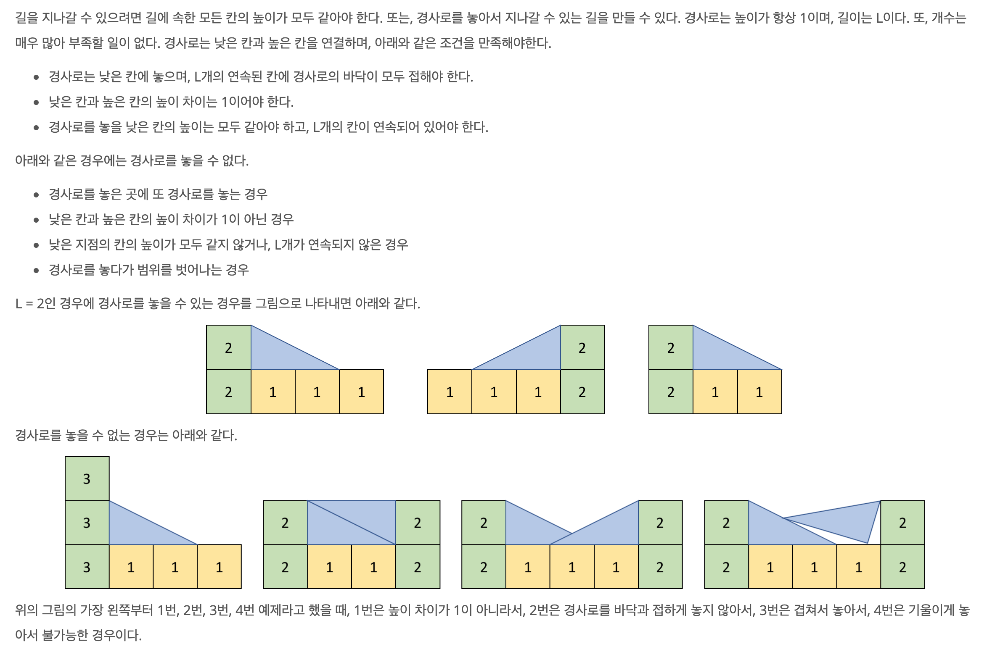

https://www.acmicpc.net/problem/14890

### 문제

### 문제 풀이

- 단순 시뮬레이션 문제이다.(모든 경우를 다 나열해도 시간에 영향 없다.)
- 행과 열의 경사로는 별개이다.(이건 왜그런지 이해 못하겠음...)
- 행 과 열을 각각 탐색해야한다.

### 순서

1. 열과 행 기준으로 각각 탐색한다.
2. 탐색하는 방향 기준으로 다음 행 혹은 열이 평평한 지 차이가 나는 지 탐색
   - 평평하다면 통과
   - 차이가 1이 아니라면 종료
   - 차이가 1 나면 3번 단계 진행
3. 좌우 혹은 상하로 각각 경사로를 놓을 수 있는 지 탐색하가.
   - 탐색하며, 평평하지 않는경우 or 범위에서 벗남 or 이미 경사로가 놓아져 있다면 종료
   - 놓을 수 있다면 각 좌표에 경사로를 놓아 준다.
4. 탐색하는 행 혹은 열이 **경로**가 된다면 카운팅 해준다.
