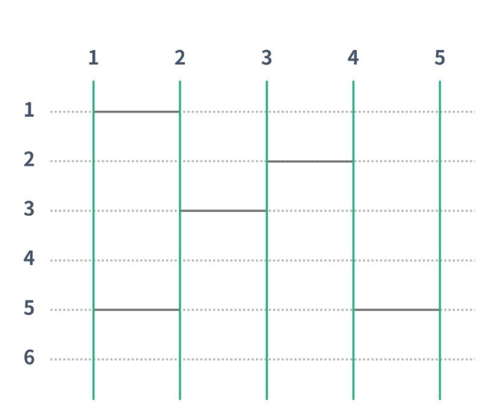

https://www.acmicpc.net/problem/15684

#### 문제 설명
- 세로선의 개수 N, 가로선의 개수 M, 세로선마다 가로선을 놓을 수 있는 위치의 개수 H (2 ≤ N ≤ 10, 1 ≤ H ≤ 30, 0 ≤ M ≤ (N-1)×H)

- 초록색은 세로선을 나타내고 점선과 교차하는 가로선을 그을 수 있다.
- 가로선의 정보는 두 정수 a과 b로 나타낸다. (1 ≤ a ≤ H, 1 ≤ b ≤ N-1) 
- 사다리 타기 게임을 진행한다.

- i번 세로선의 결과가 i번이 나오도록 사다리 게임을 조작하려면, 추가해야 하는 가로선 개수의 최솟값을 출력한다. 만약, **정답이 3보다 큰 값이면** -1을 출력한다. 또, 불가능한 경우에도 -1을 출력한다.

#### 문제 풀이

- 만약 모든 경우를 다 할 경우( 즉, 모두 선을 그어볼 경우) 시간복잡도가 2^(N*H) 2.037 035 976 334 486e+90 이기 때문에 불가능 하다.
- 하지만 조건 중 정답이 3보다 클 수 없기 때문에,최댓 값을 3으로 제한하고 모두 탐색 하면  된다.
- O(N* M *H)
- 데이터 구조를 어떻게 해야 할까 ?
    - 1~H까지 선형 탐색을 진행하면서, leg[M][H]에 다리가 있는지 체크 
- 그러면 이동하는 것을 어떻게 구현할 수 있을까 ??
    - 1~H까지 순차적으로 돌면서 한칸씩 내려가는 도중 M번째에서 연결된 다리가 있을 때 위치를 이동
- 모두 도는 경우의 수는 어떻게 구현할까 ?
    ~~- Next_Permutation을 활용해보자 !~~
    - Next_Permutation이 아니라 재귀를 사용해서 넣고 빼고한다.
