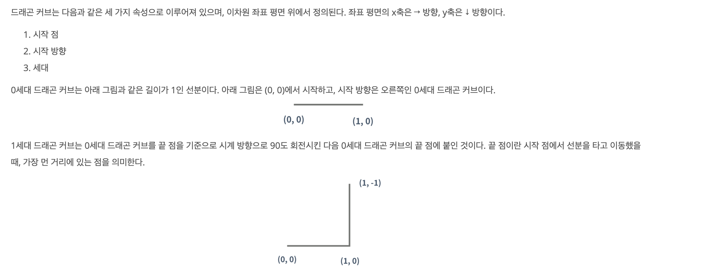
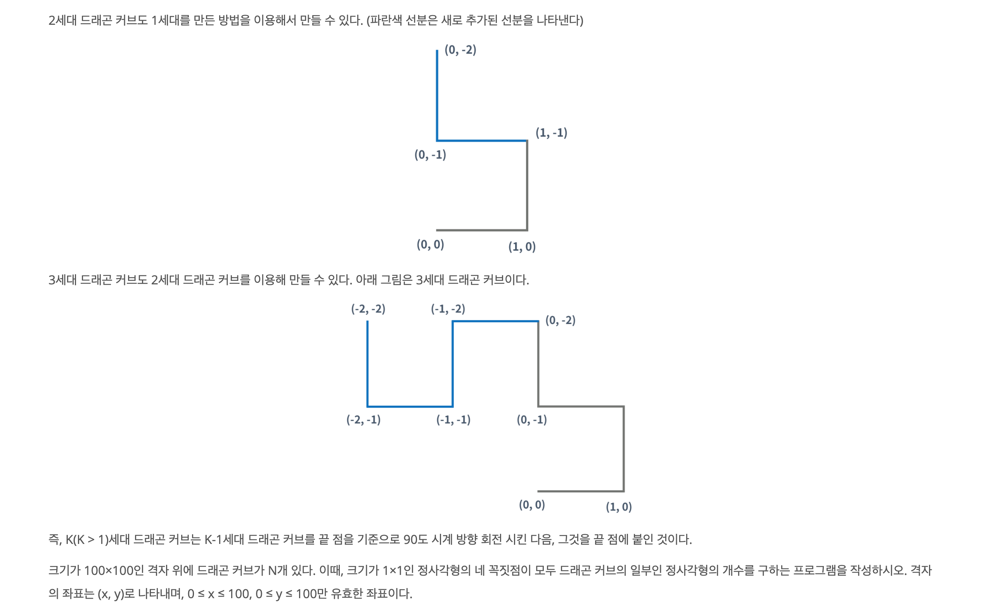
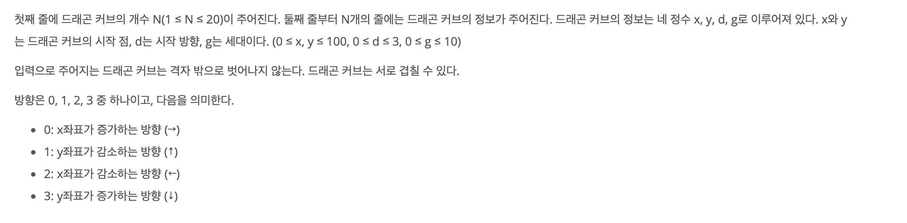
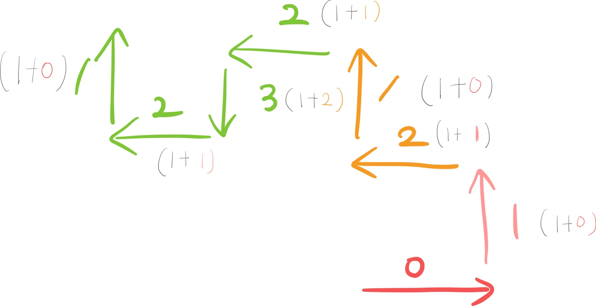
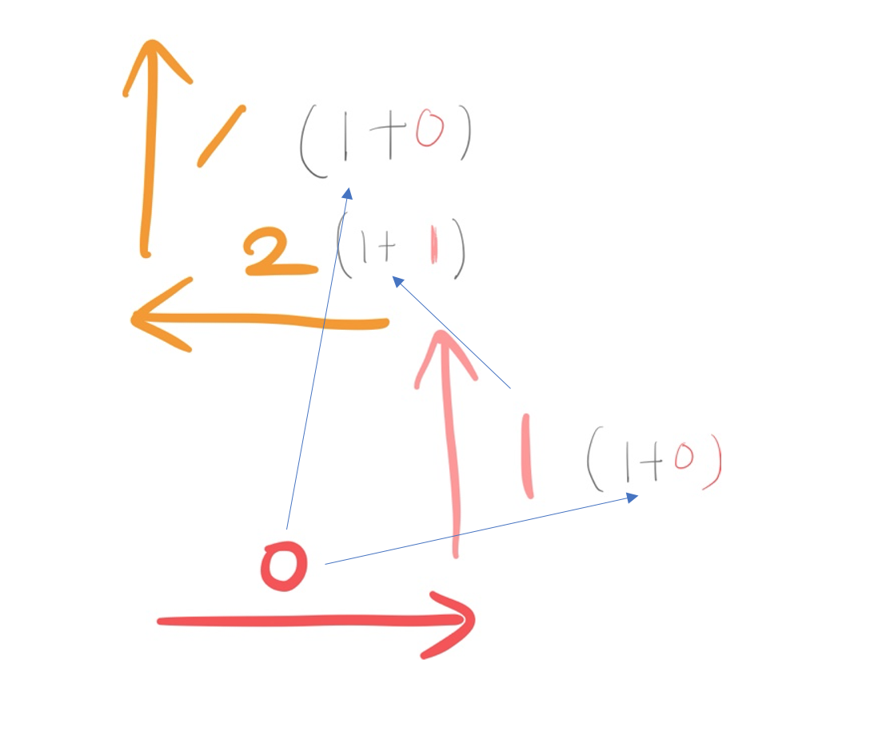

https://www.acmicpc.net/problem/15685

### 문제 설명

### 문제 풀이

> 풀이의 실패 했던 이유 :
> 좌표에서 방향 이동 (왼쪽,오른쪽) 회전에 초점을 맞춰서 숫자로 나열해서 규칙찾지 못했다.

 
 
- 방향을 틀면서 시도하면 답이 보이지 않는다. 세대의 따른 커브의 방향을 나열 해야만 규칙을 찾을 수 있다.

  

- 다음 세대 드래곤 커브는 모든 이전 세대 만큼 생성 되고 (2^k 개) **이전 세대의 커브를 역순으로 탐색 한 (방향+1)%4**로 이동한다.

> - 이 부분을 발견하지 못했다.. 시험장에선 알고신이 도달 해주길!

- 따라서 이동 할때 마다 vector에 방향을 점진적으로 저장한다. 이전 세대의 커브를 역순으로 탐색 한 (방향+1)을 현재방향 두고 좌표를 이동한다. 그 뒤 다음 세대가 활용할 수 있게 현재 좌표를 push하면서 이동한다.

- 전체 (0 ≤ x ≤ 100, 0 ≤ y ≤ 100)를 탐색하여 사각형 모양의 좌표면 카운팅을 한다.
