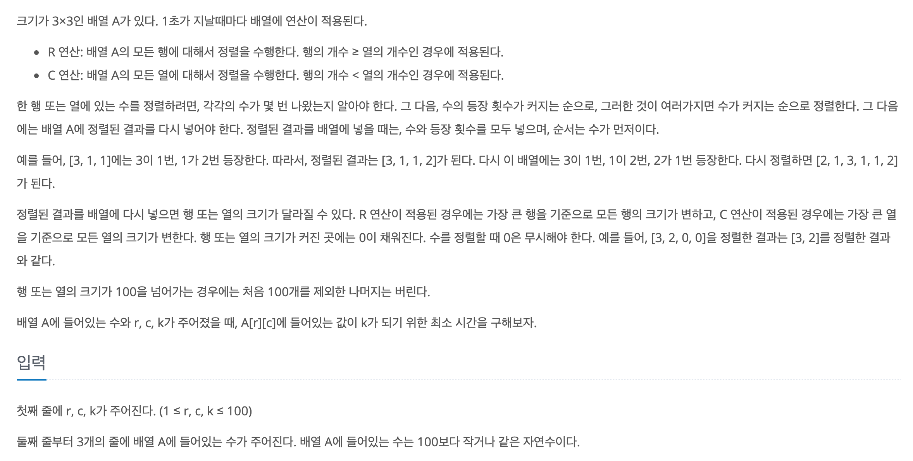

https://www.acmicpc.net/problem/17140

### 문제 설명

### 풀이

1. 각 행에서 존재하는 숫자의 갯수 Count 해준다.

   - 행과 열을 나눠서 진행한다.(같이 일반화 하려고 했다가 헷갈려서 오히려 삽질을 하는...시간 낭비를 경험했다.)
   - 처음에는 정렬하고 upper_bound() - lower_bound()를 사용해 값을 구해 대입했다.(틀린 풀이는 아니지금 너무 오래 걸렸음)
     > 숫자가 100까지 밖에 안되기 때문에 그냥 이럴땐 카운팅 해주자!

2. Count해준 숫자의 갯수와 숫자를 Vector에 넣고 수의 등장 횟수가 커지는 순,수가 커지는 순으로 정렬한다.

   - **여기서 정렬함수를 사용했는데 이것이 런타임에러의 주 원인 이었다.**

3. 행과 열 정렬 후, 대체 해주기.
   - 대체하기 전에 배열을 0으로 초기화 해야한다. (ex.이전 배열 보다 작아질 경우가 있으므로 )
4. 행과 열 최대 값 업데이트

- **100초가 지나도 A[r][c] = k가 되지 않으면 -1을 출력한다.**
  - 100초가 지난 뒤에 출력한다.

> 분리 할 수 있으면 최대한 분리하자!
