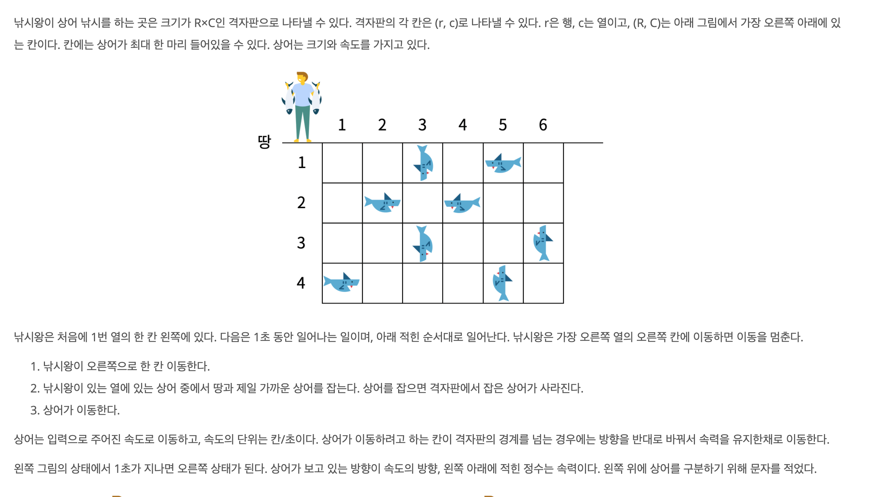
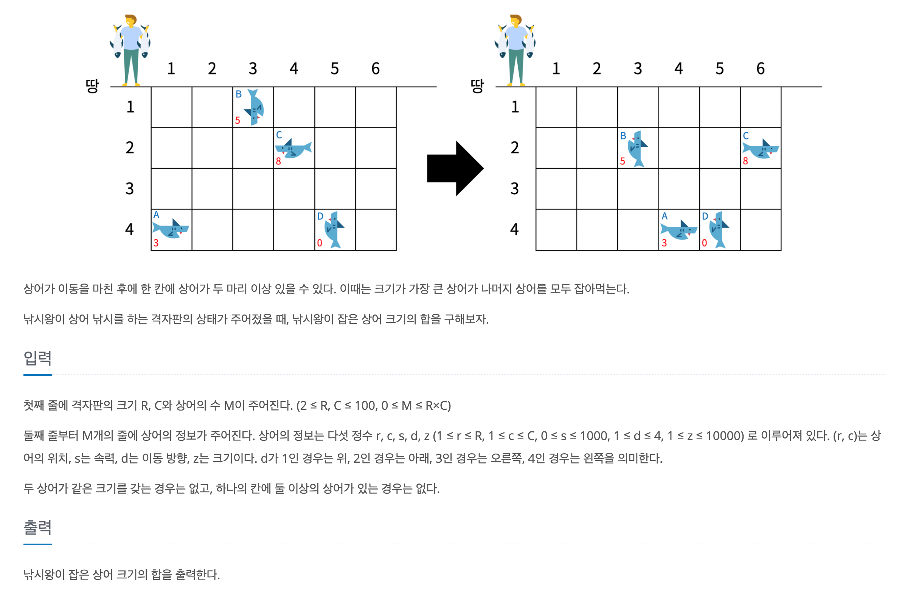

https://www.acmicpc.net/problem/17143

### 문제 설명

### 문제 풀이

1. 사람의 이동

   - 이동할 열에 가장 앞에 있는 상어를 잡는다.

2. 상어의 이동

   - 사람이 이동하는 횟수 만큼 전체 낚시 판을 순회 해야하고 만일 낚시판에 상어가 있다면 s만큼 이동해야한다.

   - 이는 시간초과를 초래한다. O(c*r*c\*s) 는 1초가 아슬아슬하다.

   - 이를 해결하기 위해 s만큼 하나 하나 반복하는 하지말고 한번에 이동해야한다.

     > 만일 =>방향으로 이동한다면 cnt -= (c - y); y = c;으로 처리한다.
     > 삼성 문제라고 무조건 시간 초과 안될 거라는 생각말자.. 꼭 시간 복잡도를 써보자 ㅠ.ㅠ

   - 이동 할 위치에 다른 상어가 있으면, 큰 상어만 남긴다.

### 순서

1. c만큼 회전 하면서 해당 하는 행에 가장 가까이 있는 상어를 잡는다.

2. 낚시판을 돌면서 해당하는 위치에 상어가 있는지 탐색한다.

3. 있다면 s만큼이동한다.

   - 만일 s만큼 이동한 후에도 범위를 벗어나지 않는다면 4단계로 간다.
   - 벗어난다면, 이동 할 방향 끝지점으로 이동(즉, abs(이동할 끝 지점-현재 위치)만큼 이동) 한 다음 방향을 바꾼다.

4. 만일 이동할 위치에 상어있는지 확인한다.

   - 상어가 있다면, 크기가 큰 상어만 남긴다.
   - 없다면 해당 하는 위치에 상어를 추가해준다.
