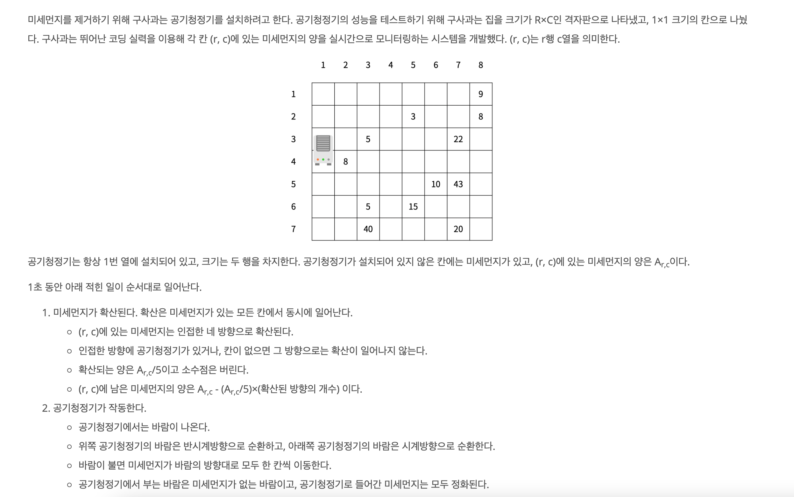
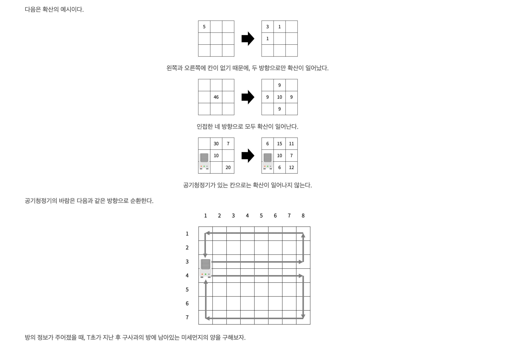

https://www.acmicpc.net/problem/17144

### 문제 풀이

- 첫째 줄에 R, C, T (6 ≤ R, C ≤ 50, 1 ≤ T ≤ 1,000) 가 주어진다.
- 둘째 줄부터 R개의 줄에 Ar,c (-1 ≤ Ar,c ≤ 1,000)가 주어진다. 공기청정기가 설치된 곳은 Ar,c가 -1이고, 나머지
- 값은 미세먼지의 양이다. -1은 2번 위아래로 붙어져 있고, 가장 윗 행, 아랫 행과 두 칸이상 떨어져 있다.

#### 순서

- 말 그대로 시뮬레이션 문제이다.
- 확신과 작동을 나눠서 구현한다.
  1. 확산
  - 확산된 값을 저장할 배열을 0으로 초기화한다.
  - 모든 좌표를 돌면서 인접한 방향에 공기청정기가 있거나, 칸이 없으면 넘어간다.
  - 상하 좌우의 값이 확산 가능하면 (현재좌표 미먼/5)을 **더한다**
    - 이때 더하지 않고 대입 하면 다른 지점에서 오는 값들이 업데이트 안된다.
  - 상하 좌우를 업데이트 한 후 현재 위치의 미먼의 (현재좌표 미먼/5)×(확산된 방향의 개수) 만큼 뺀다.
  2. 작동
  - 위 아래로 나눠서 반시계, 시계 방향으로 민다.
- 확산 및 작동 후의 공기청정기 위치를 재 표시 해준다.
