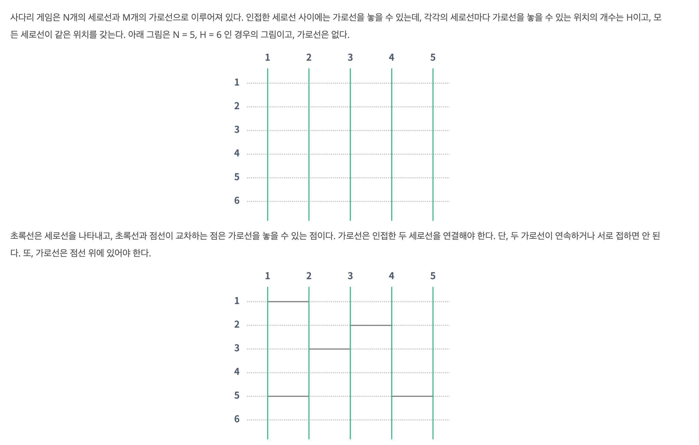
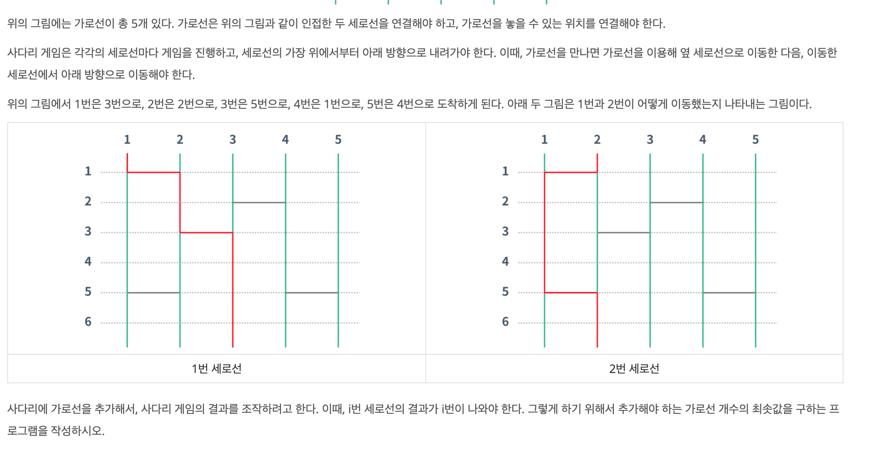
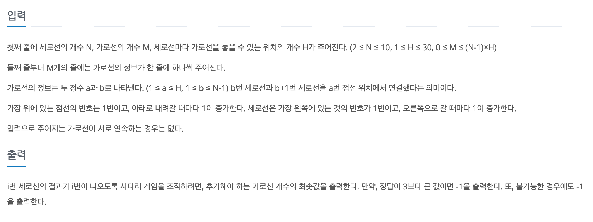

https://www.acmicpc.net/problem/15684

### 문제 설명

### 문제 풀이

- 최대 놓을 수 있는 사다리는 3 개 이므로 사다리를 놓는 경우의 수는 300^3이다. 사다리로 이동하는 경우의 수는 N * H임으로 최대 시간 복잡도는 (N *H \* 300^3)으로 충분하다.

1. 사다리 놓기

   - 재귀를 사용하여 좌표 값에 3개의 사다리를 놓는다.
   - 만일 해당하는 좌표 x][ y ]o r 그 다음 좌표[ x ][y+1] 가 이미 사다리라면 넘어간다.
   - 위에 조건이 아니라면 해당하는 좌표 [ x ][y]와 다음 좌표[ x ][ y+1 ]에 사다리를 놓는다.
     - 이때 사다리의를 시작점인 y 값으로 저장하여 시작 사다리를 구분한다.

2. 사다리 이동

   - 해당하는 열을 기준으로 행을 탐색한다.

     - 시작점 열로 시작하여 해당 행에 사다리가 있는 지 탐색
     - 현재 기준점이 1 이거나 마지막 열이면
       - 1열이라면 =>2열로 , N열이라면 N-1로 이동한다.
     - 그 외경우 좌우로 사다리 확인
       - 왼쪽 사다리 인지 오른쪽 사다리가 인지 확인하고 해당 위치로 기준점 이동한다.
       - [i][start - 1] == p[i][start] or [i][start + 1] == [i][start]

   - 시작점과 도착점이 같다면 카운팅

3. 모든 결과가 시작점과 도착점이 일치하면 추가한 다리 횟수 저장

> 처음에 최솟값 구하는 것이기 때문에 답 구해지면 바로 종료 했다.
> 재귀 때문에 사다리갯수가 계속 바뀌기 때문에 ans = min(ans, cnt);로 다 받아야한다.
