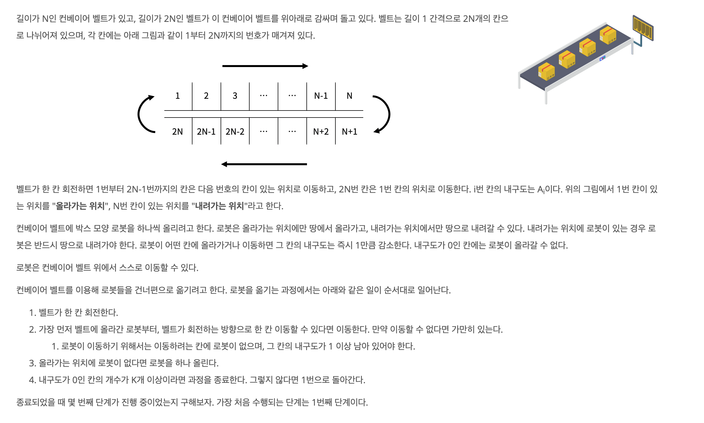
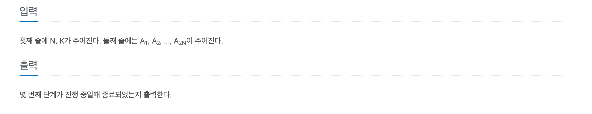
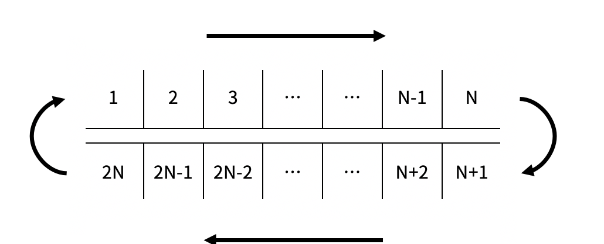

https://www.acmicpc.net/problem/20055

### 문제 설명

### 문제 풀이

- 시뮬레이션 으로 가능하다.
- **컨베이어 벨트는 2N이고 로봇은 N벨트에서 움직인다.**

  > 이 부분을 케치하지 못했다. 처음에 로봇도 2N으로 풀어버리는 실수를 범했다.

### 순서

1. 컨베이어 벨트 이동

   - 로봇과 같이 컨베이어 벨트가 이동한다.

   1. 컨베이어 벨트 이동

   

   - 해당 규칙을 따라 이동한다.

   2. 로봇의 이동
      - 1~ N-1까지의 로봇이 컨베이어 벨트를 따라 이동한다. N-1위치에 있는 로봇은 내려간다.

2. 로봇의 이동

   - 1~ N-1까지의 **로봇만** 이동한디.
     - 로봇이 있거나, 내구도가 0이라면 남아있는다.
     - 로봇이 없고 내구도가 1이상이면 다음 칸으로 이동하고 이동한 칸의 내구도를 1줄인다.
       - 줄인 뒤에 현재 내구도가 0이면 카운팅한다.

3. 로봇 추가

   - 로봇이 없고 내구도가 1이상이면 다음 칸으로 이동하고 이동한 칸의 내구도를 1줄인다.
     - 줄인 뒤에 현재 내구도가 0이면 카운팅한다.

4. 전체 내구도가 0인 칸의 갯수가 K이상이면 종료한다.
