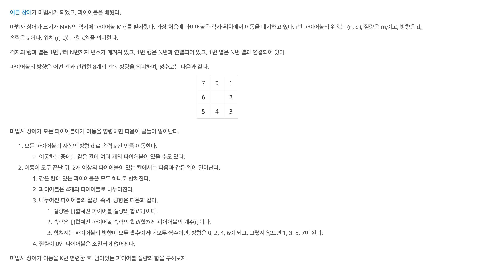
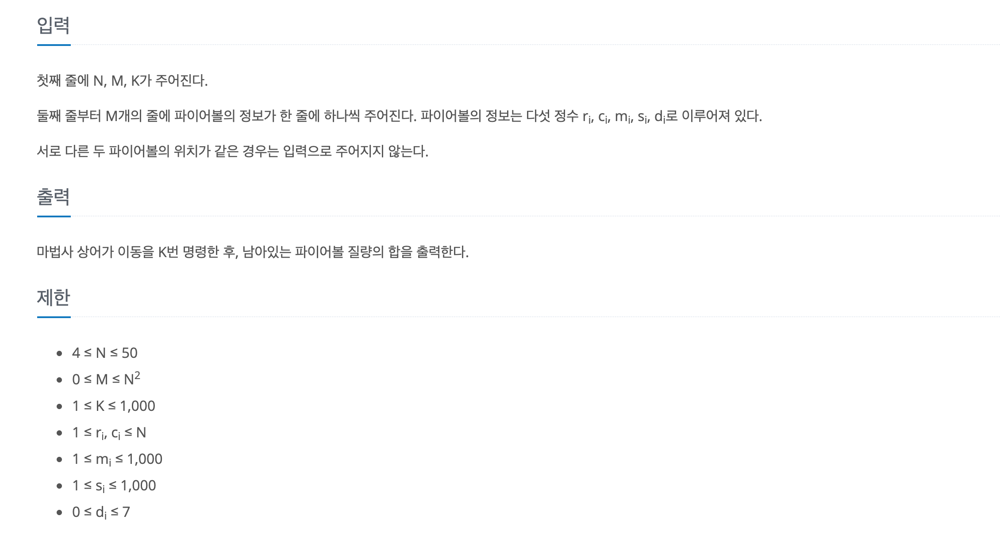

https://www.acmicpc.net/problem/20056

### 문제 설명

> `격자의 행과 열은 1번부터 N번까지 번호가 매겨져 있고, 1번 행은 N번과 연결되어 있고, 1번 열은 N번 열과 연결되어 있다.`
> 이는 1을 넘어가면 =>N ,N을 넘어가면 1이 된다는 의미다.(이 부분을 이해하지 못해 1시간 이상 낭비했다...)

### 문제 풀이

- 파이어볼 이동시간 복잡도 O(N*N*s*1000*4), 나누는 시간 복잡도O(N*N*4) 이기때문에 시뮬레이션 구현이 가능하다.
- 한 좌표에 대해 넣을 수 있는 파이어 볼이 4개 이니 vector <{m.s.d}>map [51][51] 자료 구조를 이용한다.

1. 파이어볼 이동

   1. 모든 좌표를 돌면서 해당 좌표에 파이어볼이 있으면 s만큼 이동

   - 방향대로 이동 시 ,범위를 안 넘으면 계속 진행
   - 만일 범위를 넣으면 **각 행,열 좌표에서 N에서=>1,1==>N으로 이동**
     > 여기서 삽질을 많이 했다. 모든 방향마다, 조건을 걸어 줬는데 그냥 **N에서=>1,1==>N** 검사로 통일해도 된다.
     > 끝지점에서만 범위 넘어가는 예외 처리만 해줘서 처음에 틀렸다.(ex. 2,3위치세 있을때 1번 방향으로 이동)

   2. s만큼 이동 후 해당 파이어볼 위치에 {m,s,d} 추가

1. 파이어볼 합치고 나누기
   1. 모든 좌표를 돌면서 해당 좌표에 파이어볼이 **1이상이면**
   2. ⌊(합쳐진 파이어볼 질량의 합)/5⌋,속력은 ⌊(합쳐진 파이어볼 속력의 합)/(합쳐진 파이어볼의 개수)⌋,파이어볼의 방향을 체크한다.
      - 방향 체크는 odd 변수에 방향이 짝수일 때 +1 ,홀수 일때 -1로 카운팅함
      - |odd | 값이 해당 좌표 파이어볼의 갯수와 같은 지 체크)
1. 해당 좌표의 vector을 초기화 하고 4개로 나뉜 파이어볼 {m,s,d} 추가
