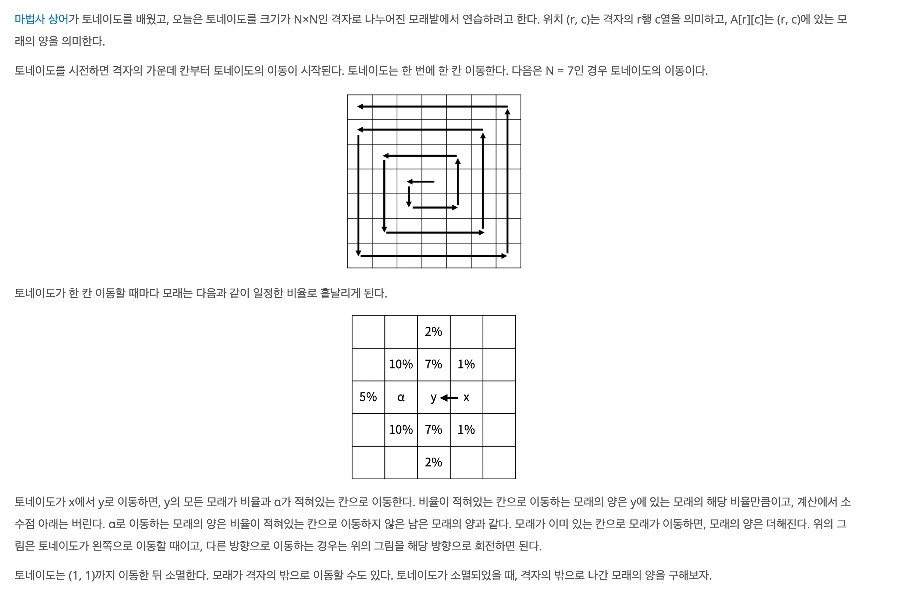
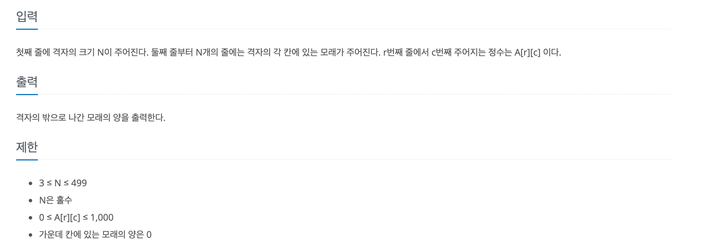
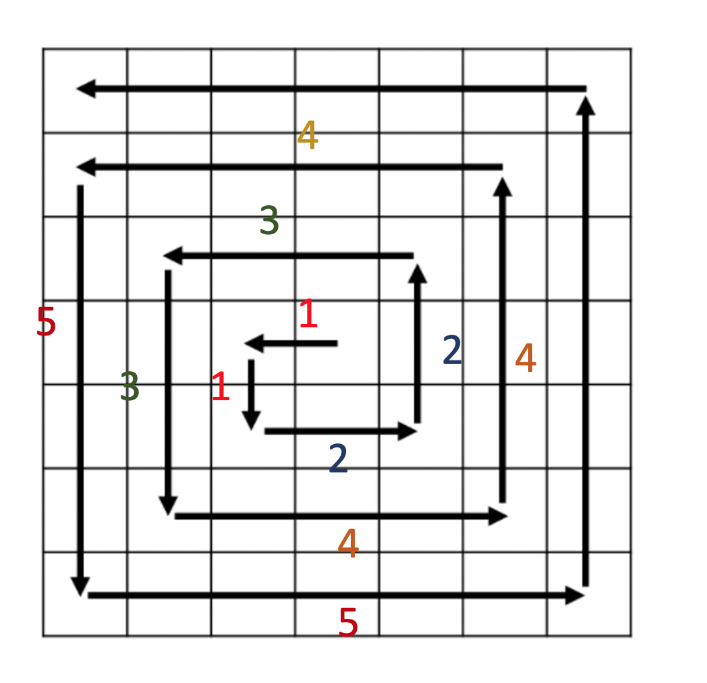
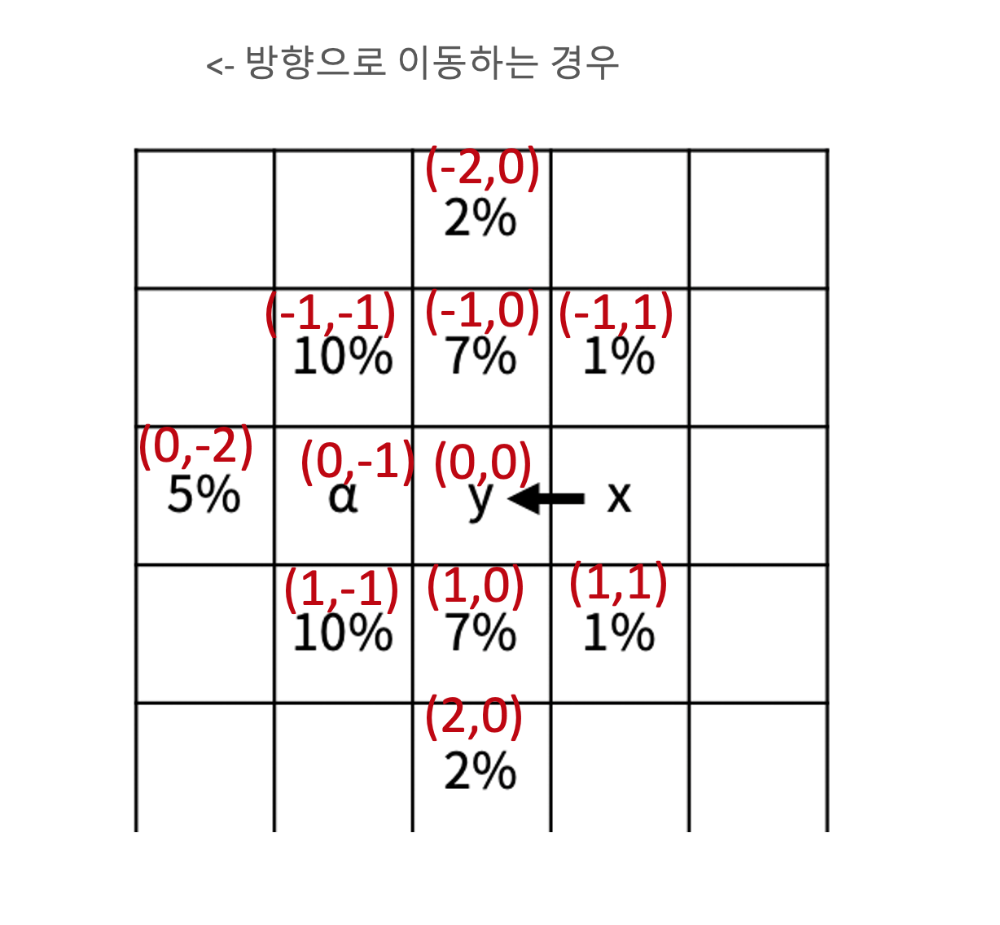

https://www.acmicpc.net/problem/20057

### 문제 설명

### 문제 풀이

- 이 경우는 두 가지 파트로 나눌 수있다.(토네이도 이동,모래 이동)

1. 토네이도 이동

- 해당 그림을 통해서 이동 규칙을 파악 할 수 있다. (1,1) (2,2) ,(3,3).. 칸 으로 같은 방향으로 이동하되 방향은 계속 바뀐다.
- 따라서 두 번 마다 칸수를 늘려주고 , 한 번(칸들의) 이동이 끝나면 방향을 바꿔준다.

2. 모래 이동

- y를 기준으로 이동 방향마다 다르게 모래 양이 퍼진다.
- 이런 경우에는 공통화 작업보다는 배열을 사용해서 모든 이동 방향과 모래양의 %를 저장하고 방향에 따라 이동하는 것이 좋다.
