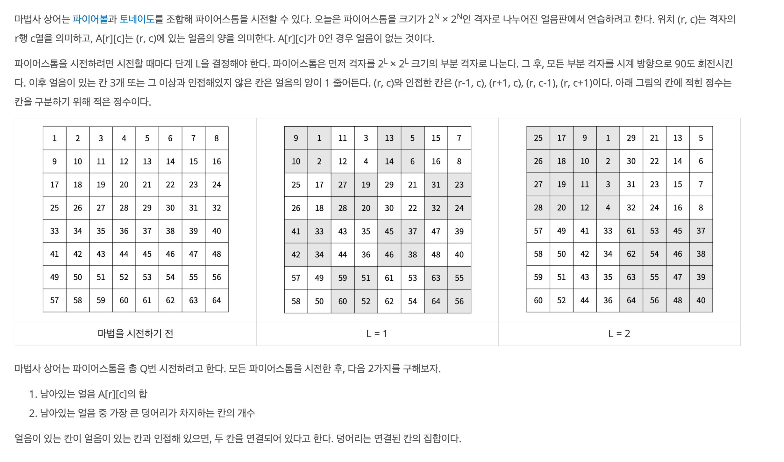
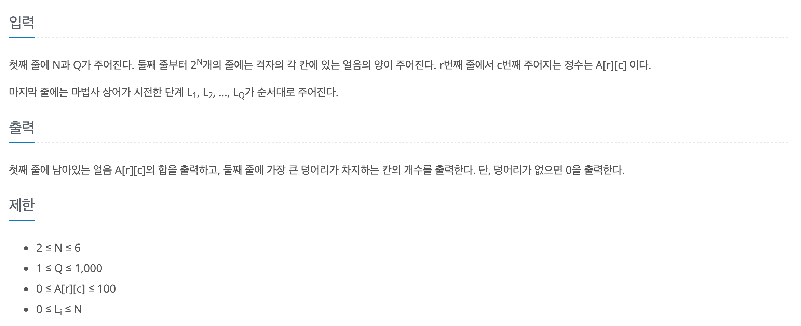
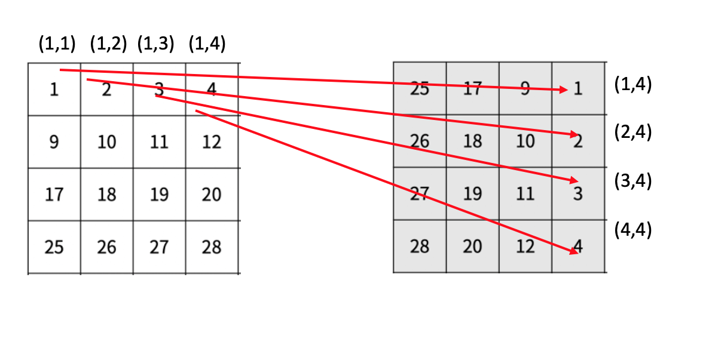

https://www.acmicpc.net/problem/20058

### 문제 설명

### 문제 풀이

1. 분할 정복을 통해 2^L × 2^L 격자로 부분을 나눈다.
2. 만일 현재 격자 크기가 2^L과 같으면 모든 부분 격자를 시계 방향으로 90도 회전시킨다.

    
    
    - 해당 방식으로 회전 한다.

   > 위에 예시 순서가 L1 >L2로 가는 줄 알고 회전 부분을 완전 다르게 풀었다.

3. 전체 회전 후, 인접칸을 검사하여, 얼음이 3칸 이하일 경우 현재 좌표의 얼음을 1줄인다.
4. Q 만큼 진행 후 , 최댓칸 수와 전체 얼음의 양을 구한다.
   - 최대 칸 수는 DFS를 통해 구한다.
