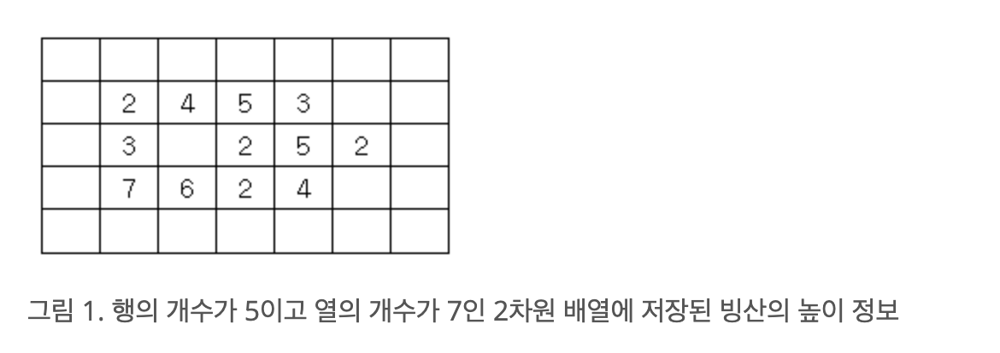

https://www.acmicpc.net/problem/2573

### 문제 풀이
- N과 M은 3 이상 300 이하이다.
- 빙산을 그림 1과 같이 2차원 배열에 표시한다고 하자. 

- 빙산의 각 부분별 높이 정보는 배열의 각 칸에 양의 정수( 값은 0 이상 10 이하)로 저장된다. 
- 1 이상의 정수가 들어가는 칸의 개수는 10,000 개 이하이다
- 배열에서 빙산의 각 부분에 해당되는 칸에 있는 높이는 일년마다 그 칸에 동서남북 네 방향으로 붙어있는 0이 저장된 칸의 개수만큼 줄어든다.(단, 각 칸에 저장된 높이는 0보다 더 줄어들지 않는다. )
- **한 덩어리의 빙산**이 주어질 때, 이 빙산이 두 덩어리 이상으로 분리되는 최초의 시간(년)을 구하는 프로그램을 작성하시오. 
    - 전부 다 녹을 때까지 두 덩어리 이상으로 분리되지 않으면 프로그램은 0을 출력한다.

#### 순서
1. N*M의 배여을 모두 돌면서 빙산인 지역이면 상하좌우가 바다인지 체크
2. 1에서 녹은 지점이 있는지 체크
    - 녹지 않았음 빙산이 이미 없어진 상태이자 두 덩이 이상으로 분리가 되지 않은 상태 임
    - **이때 카운팅과 동시에 녹이지말고 얼마나 녹는 지를 따로 저장한 뒤에 한번에 녹게끔해야한다.**
        - 이미 녹아버려서 다른 지점에 영향을 끼칠 수 있다. ex) 먼저 0으로 변해버려서 이웃하는 지점에 영향 끼치는 경우
3. 녹은지점이 있으면 BFS를 돌면서 두 덩이로 나눠져 있는 지 체킹
    - 나눠져 있다면 종료 

