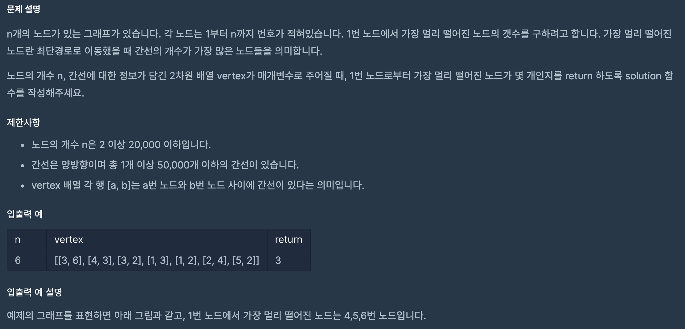

https://programmers.co.kr/learn/courses/30/lessons/49189

### 문제 설명

### 문제 풀이

- 총 1개 이상 50,000개 이하의 간산이기 때문에 BFS를 돌아도 된다.
- BFS를 돌면서 거리 값이 최대 일때 카운팅을 갱신한다.

1. 객체로 인접리스트를 만든다.
2. BFS를 순회 한다.
   - 인접 노드와 거리를 함께 저장한다.
   - 거리가 최대 일때, 카운팅 숫자를 0으로 갱신한다.
   - 거리가 최대와 같을 때, 카운팅을 1 올린다.
