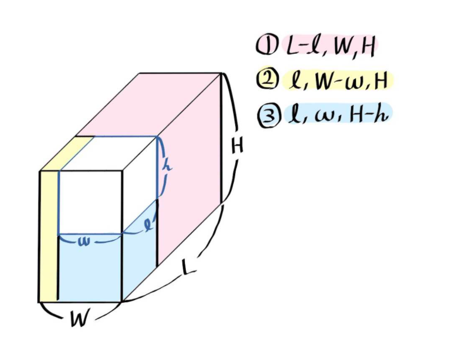

https://www.acmicpc.net/problem/1493
### 문제 풀이
- 1 ≤ length, width, height ≤ 10^6 박스는 직육면체이다 
- 1 ≤ n ≤ 20 ,0 ≤ Ai < 20,0 ≤ Bi ≤ 10^6
-  한 변의 길이는 2의 제곱꼴이다.(1×1×1, 2×2×2, 4×4×4, 8×8×8, ...)
- 세준이가 가지고 있는 큐브의 종류의 개수 N
- 총 N개의 줄에 큐브의 종류 Ai와 개수 Bi가 순서대로 주어진다. 큐브의 종류는 한 변의 길이를 나타낼 때 쓰는 2^i에서 i이다.
- 필요한 큐브의 개수의 최솟값을 출력한다. 만약 채울 수 없다면 -1을 출력한다.

#### 순서
- 부피로 비교하며 되는가 ?
    - 안된다. 만일 어떤 큐브를 넣었을 때, 직육면체가 깨지기 때문에 
- 모든 길이가 배수와 약수 관계를 유지할 때, 무조건 큰 길이부터 넣는 그리디한 전략을 사용할 수 있다.

[그림출처 :https://yeeybook.tistory.com/95]

- 이미 채워진 부분을 제외한 남은 부분의 길이로 각 직육면체 3개를 만들어 재귀를 사용해 채운다.
- ~~하나씩 (w,l-길이,h) (w-길이,l,h) (w,l,h-길이)로 나누는 줄 알았음~~ 

