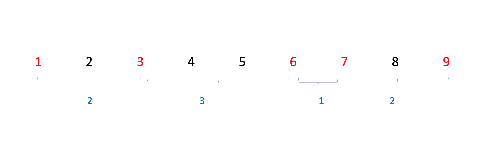
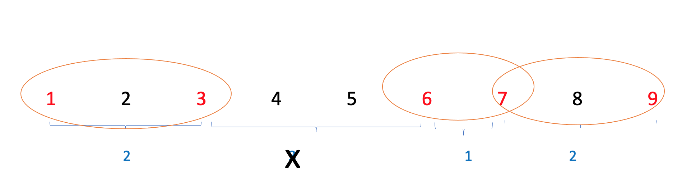

https://www.acmicpc.net/problem/2212

### 문제 설명
- 첫째 줄에 센서의 개수 N(1<=N<=10,000),둘째 줄에 집중국의 개수 K(1<=K<=1000)가 주어진다
- 셋째 줄에는 N개의 센서의 좌표가 10미만이다. 좌표의 절댓값은 1,000,000 이하이다.
- 고속도로 위에 최대 K개의 집중국을 세울 수 있다고 한다.
-  센서들은 이 직선 위의 한 기점인 원점으로부터의 정수 거리의 위치에 놓여 있다고 하자.
- 집중국의 수신 가능 영역은 고속도로 상에서 연결된 구간으로 나타나게 된다.
-  N개의 센서가 적어도 하나의 집중국과는 통신이 가능해야 하며 집중국의 수신 가능 영역의 길이의 합을 최소화해야 한다.ㄴ
-  각 집중국의 수신 가능영역의 거리의 합의 최솟값을 구하는 프로그램을 작성하시오.(단, 집중국의 수신 가능영역의 길이는 0 이상이며 모든 센서의 좌표가 다를 필요는 없다.)

#### 풀이
- arr []: 좌표
- dist[]: 좌표간 인접한 거리 

- 전체 거리는  인접한 거리의 합과 같다. 
    - **해당 부분을 놓쳐서 이 문제를 해결 하지 못했다.**

- 따라서 각 인접한 거리에서  한 부분의 거리를 뺐을 때, 그 부분의 집중국이 세워진 것과 같다.

- 최솟 값을 구하기 위해선 각 인접한 거리를 내림차순으로 인접한 거리를 빼면된다.
(K개의 집중국을 K개의 직선으로 바꿔서 생각하면 쉽게 해결이 가능한 문제이다. 가능영역 거리의 최소는 센서 사이 직선의 최소 길이로 바꿔 생각)

순서 

1. 좌표값을 받고 오름 차순 정렬한다.
    - 이를 통해 인접한 좌표간 거리를 구하기 위해서
2. 정렬한 좌표들을 탐색 하며 인접한 거리를  구한다.
3. 인접한 거리들을 내림차순으로 나열한다.
4. 전체 거리에서 (K-1)민큼 인접한 거리를 빼준다. 