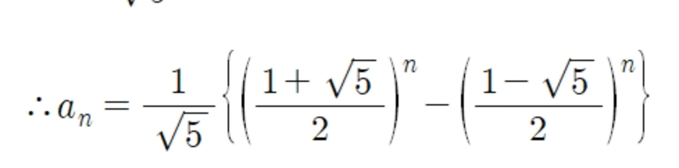
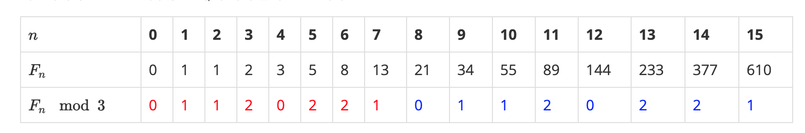

https://www.acmicpc.net/problem/2749
#### 문제 설명
- n은 ((1 ≤ n ≤ 1,000,000,000,000,000,000)
- Fn = Fn-1 + Fn-2 (n ≥ 2)
- n이 주어졌을 때, n번째 피보나치 수를 1,000,000으로 나눈 나머지를 구하여라

#### 문제 풀이
- n이 10억보다 훨씬 크기 때문에 전체를 탐색하는 O(n)으로 해결할 수 없다.
- O(logn) 이나 O(1)로 해결해야 한다.
- 수하적 귀납법에 의해 증명된 Fn의 일반항에 변수를 대입해서 O(1)으로 해결하려고 했으나 알고리즘 스럽지 않아서

[피보나치 수열 일반항]
- 따라서 규칙을 찾는 방식을 탐구해야한다.
- 피보나치 수를 K로 나눈 나머지는 항상 주기를 가지게 된다. 이를 피사노 주기(Pisano Period)라고 한다.
- 이는 나머지가  3으로 피보나치의 값들을 나누면 8을 길이로 피사노 주기를 발견 할 수 있다.
 
[출처 :https://www.acmicpc.net/blog/view/28]
- 주기의 길이가 P이면 N번째 피보나치 수를 M으로 나눈 나머지는 N%P번째 피보나치수를 M으로 나눈 나머지와 같다.
-  M = 10^k 일 때, k > 2 라면, 주기는 항상 15 × 10^k-1이다.
- 따라서 M=1000000 이므로 주기는 15*100000이다.

