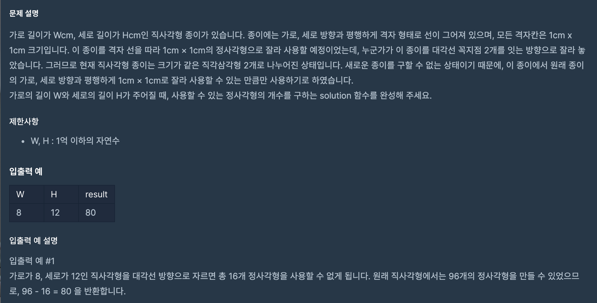
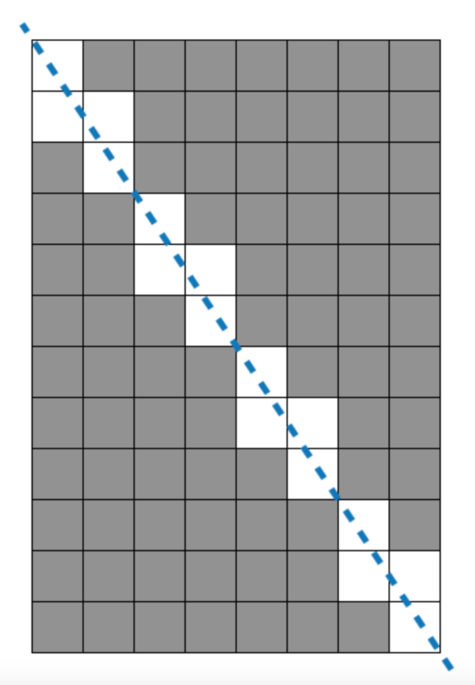
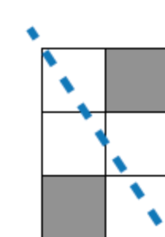
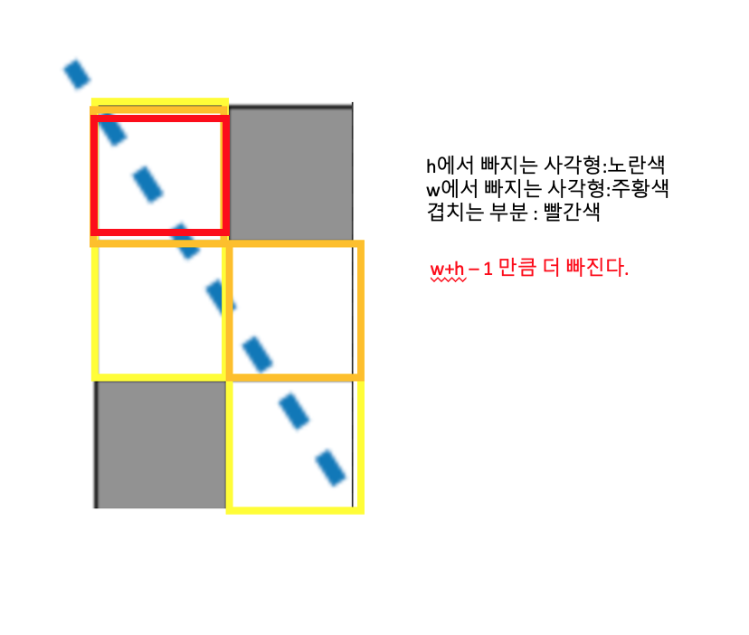
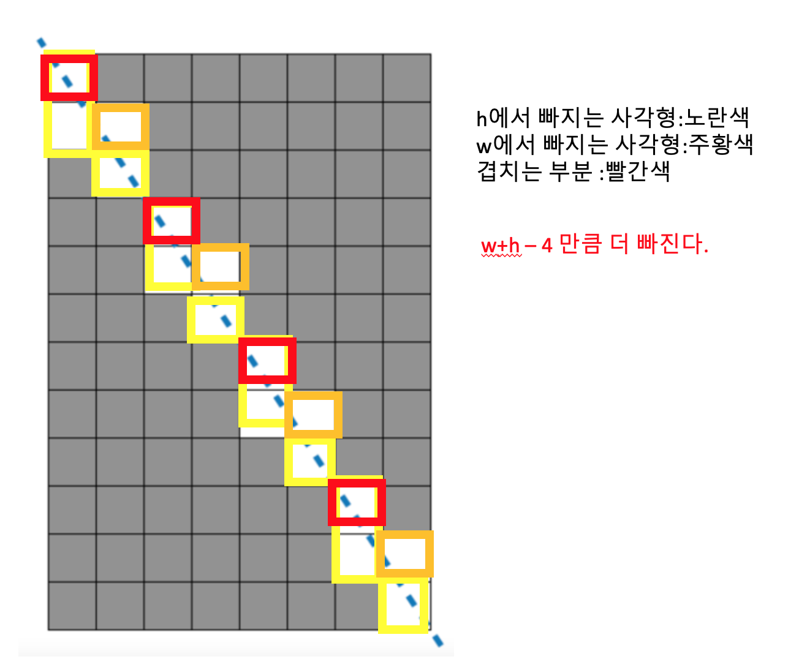

https://programmers.co.kr/learn/courses/30/lessons/42839

### 문제 설명

### 문제 풀이

- 이 문제는 규칙을 발견 하지 못하면 해결하기 어렵다. 작은 숫자 부터 뜯어보면서 찾아야한다.

 

- w:2 h:3 일 경우이다.총 w \* h에서 몇게가 빠지는 지 확인해야한다.

 

> 4개가 빠진다. 이는 (w+h -1)이다.

 

- w:8 h:12 일 경우이다.

  - w:2 h:3 일때에서 4번 반복된다.
    

> 16개가 빠진다.(w+h-4)이다.

##### 이것이 의미하는게 무엇일까 ?

- 자세히 보면 선은 가로와 세로만큼 지난다.
- 여기서 너비와 높이 마다 더 빠지기도 덜 빠지기도 한다.
- (너비+ 높이 -겹치는 부분) 만큼 빼줘야한다.
- 이는 (w+h -(w와 h의 최대 공약수)) 이다.

> 본인은 가로 세로가 홀수,짝수에 따라 변하는 사각형의 갯수 규칙을 찾으려고 했다.
