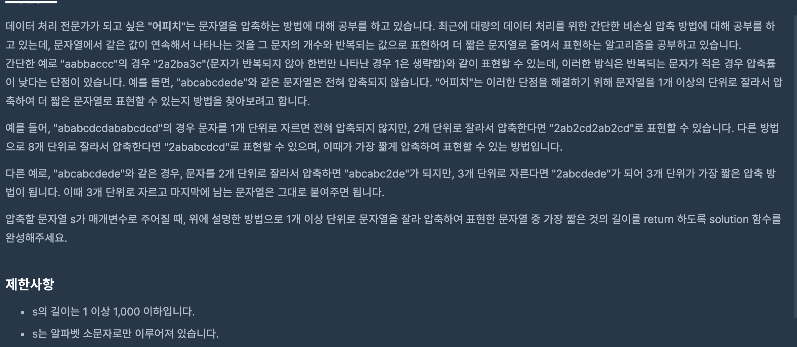

https://programmers.co.kr/learn/courses/30/lessons/60057?language=cpp

### 문제 설명

### 문제 풀이

- s의 길이가 1000이기 때문에 1~1000까지 끊어서 모두 다 탐색해도 시간이 충분하다.
- 특정 길이를 기준으로 slice하면서
- 참고로 slice함수의 경우 배열의 숫자를 넘어도 최대 범위까지만 추가한다.

> 만일 끊는 기준 점이 3이면 모두 3으로 통일해서 끊어야 하는데,최소 길이를 만드는 것으로 착각해서 풀었다.
>
> - 이러한 특징 때문에 for문으로 3만큼 건너뛰면서 풀어도 된다..
>   숫자를 더하는 방향으로 했는데 문자열을 만든 뒤에 카운팅하는게 낫다..
