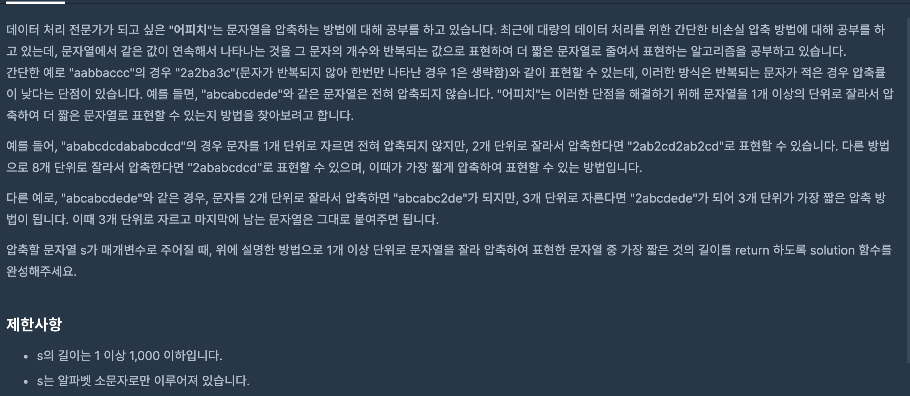

https://programmers.co.kr/learn/courses/30/lessons/60057?language=cpp

### 문제 설명

### 문제 풀이

- s의 길이가 1000이기 때문에 1~1000까지 끊어서 모두 다 탐색해도 시간이 충분하다.
-

> 만일 끊는 기준 점이 3이면 모두 3으로 통일해서 끊어야 하는데,최소 길이를 만드는 것으로 착각해서 풀었다.
> while문으로 이동해도 되지만 이럴땐 for문으로 이동해도 충분한다.
