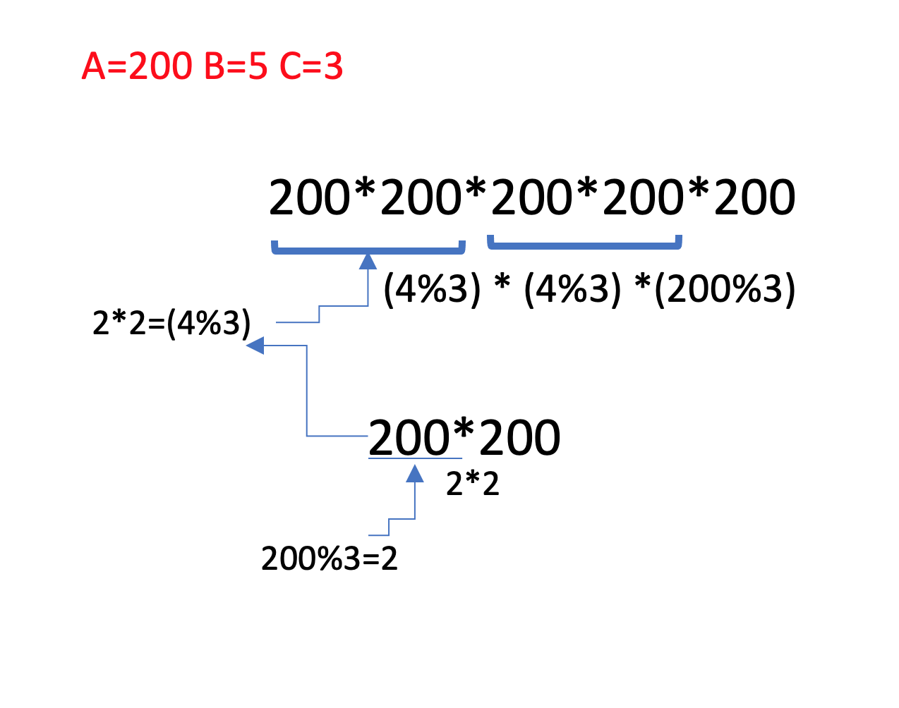

https://www.acmicpc.net/problem/1629

### 문제 설명

- 자연수 A를 B번 곱한 수를 알고 싶다. 이를 C로 나눈 나머지를 구하는 프로그램을 작성하시오.
- A, B, C가 빈 칸을 사이에 두고 순서대로 주어진다.
- A, B, C는 모두 2,147,483,647 이하의 자연수이다.

### 문제풀이

- 전형 적인 분할 정복 문제이다.
- B가 2,147,483,647라면 완전 탐색으로는 시간 초과가 된다.
- 따라서 O(logB)가 나오는 분할 정복으로 풀이한다.

#### 순서

1. 재귀를 사용한다.
2. 종료 조건을 1일때 A%C를 반환으로 컷한다.
3. 그 이외의 경우 재귀적으로 go(B/2)을 으로 반환 값을 구한다.

- B/2가 짝수이면 go(B/2)\*go(B/2)%C
- B/2가 짝수라면 (go(B/2)*go(B/2)*A)%C로

* 2,147,483,647가 넘지 않도록 %C를 반환값 마다 모두 해줘야한다.
