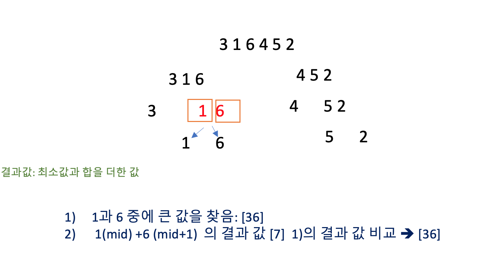
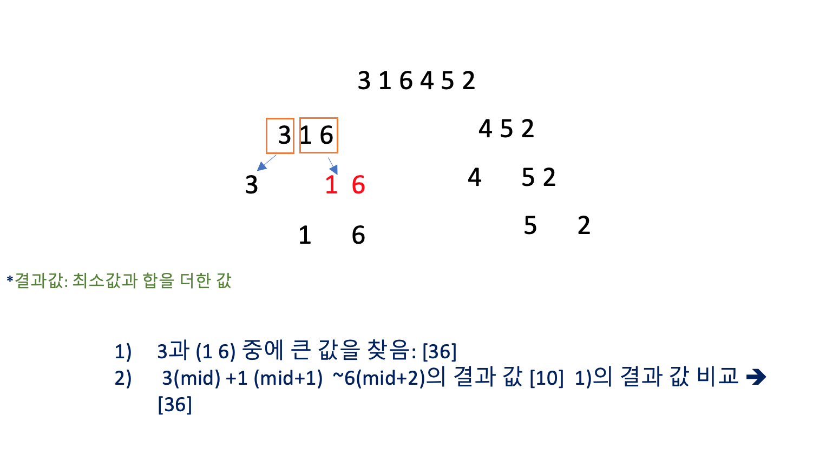
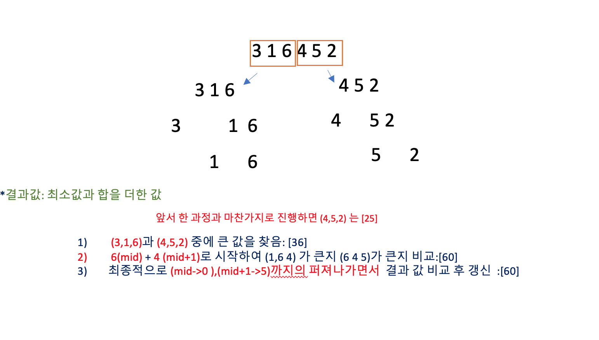

https://www.acmicpc.net/problem/2104

### 문제 설명

- 크기가 N(1≤N≤100,000)인 1차원 배열 배열 A[1], …, A[N]이 있다.
- 어떤 i, j(1≤i≤j≤N)에 대한 점수는, (A[i]+…+A[j])×Min{A[i], …, A[j]}가 된다. 
- 즉, i부터 j까지의 합에다가 i부터 j까지의 최솟값을 곱한 것이 점수가 된다.
- 배열이 주어졌을 때, 최대의 점수를 갖는 부분배열을 골라내는 프로그램을 작성하시오.

### 문제풀이
- 처음 고안했던 방법은 부분합 구하는 방식 [x]
    -  **index가 넘어가는 기준 점**이 없음
- 가장 큰 숫자를 찾아서 그것을 기준으로 좌우로 탐색 한다 [x]
    - **반례 ) 6 1 2 5 4**
- 중간에서 시작하여 left와 right중 더 큰값에 방향으로 탐색 (만일 한쪽이 다 탐색 되면 다른 쪽) [x]
 ==> **반례) 5 85 1 1 2 69**

> 정답 :
> -  분할 정복으로 (left~mid) ,(mid+1~right) 이분 탐색으로 **최대 값을 확인**  그러나 __걸쳐 있을 수도 있다.__
> - 반복문을 사용하여, (mid,mid+1)을 시작으로 (left~mid) (mid+1~right값 들을 확인하면서 가운데 부분 부터 퍼져나가는 방식으로 최댓값을 구한다.

 
 
 

#### 순서

1. 재귀를 사용하여 왼쪽 배열의 부분합 ,오른쪽 배열의 부분합의 최댓값을 구한다.
2. 교차하는 부분의 탐색을 위하여 sum=v[mid]+v[mid+1]을 시작으로 양 끝까지 퍼지는 방향으로 확인하면서 최댓값을구한다.

