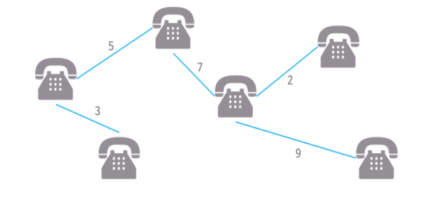

https://www.acmicpc.net/problem/1197
### 문제 풀이
- 첫째 줄에 정점의 개수 V(1 ≤ V ≤ 10,000)와 간선의 개수 E(1 ≤ E ≤ 100,000)가 주어진다.

- 세 정수 A, B, C가 주어진다. 이는 A번 정점과 B번 정점이 가중치 C인 간선으로 연결되어 있다는 의미이다. C는 음수일 수도 있으며, 절댓값이 1,000,000을 넘지 않는다.

- 첫째 줄에 최소 스패닝 트리의 가중치를 출력한다.

### 개념 
##### Spanning Tree MST란 ?
> - 그래프 내의 모든 정점을 포함하는 트리(방향 x)
> - Spanning Tree 에서 사용된 간선들의 가중치 합이 최소 인 트리
> - 특정 점에서~ 다른 지점으로 이동이 아니라 모든 지점이 서로 **연결** 되어있어야한다.
> - n개의 정점을 가지는 그래프에 대해 반드시 (n-1)개의 간선만을 사용해야 한다.
> - 사이클을 포함해서는 안된다. 

 
 

 ##### Kruskal MST 알고리즘
 > - 탐욕적인 방법(greedy method) 을 이용하여  모든 정점을 최소 비용으로 연결하는 최적 답을 찾는 법 
 >    - 다익스트라(한 지점을 기준을 모든 노드에 갈 수 있는 가장 짧은 경로)랑 다르다
 > - 시간 복잡도는 edge e의 개수에 따른 O(eloge)

### 순서

 1. 모든 간선들의 가중치를 오름차순으로 정렬한다.
 2. 가중치가 가장 작은 간선을 선택한다.
 3. 2에서 선택한 간선이 연결하려는 2개의 노드가 아직 서로 연결되지 않은 상태라면, 2개의 노드를 서로 연결한다.(union - find로 확인해준다. 같은 부모라면,연결 X 하지 않고 , 다른 부모라면 서로 연결)
    - 연결 되지 않은 가중치를 더해준다.
 4. 위의 과정을 반복한다.

