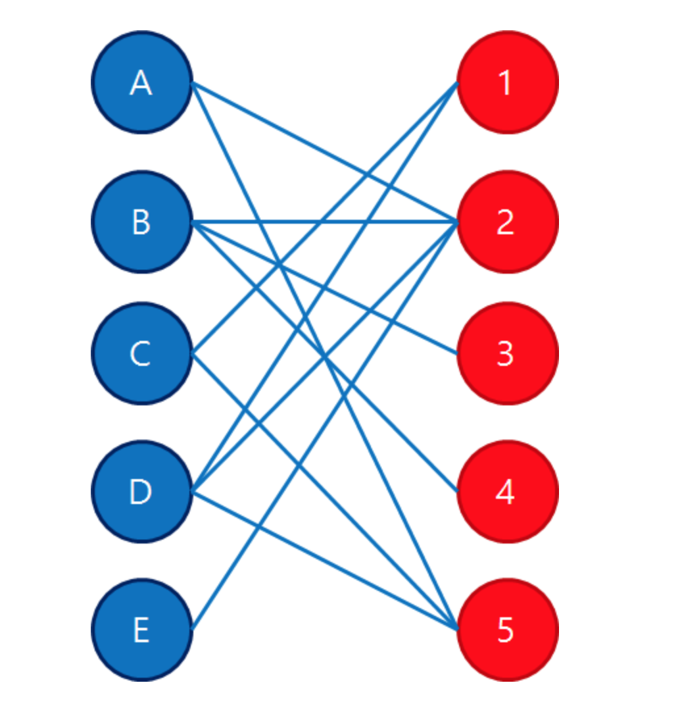

https://www.acmicpc.net/problem/2188
### 문제 풀이
- 소의수 N,축사의수 M M(1≤M,N≤200)
- N개의 줄에는 각 소가 들어가기 원하는 축사에 대한 정보가 주어진다. 
- i번째 소가 들어가기 원하는 축사의 수 Si (0 ≤ Si ≤ M)이 먼저 주어지고, 이후 Si개의 축사 번호가 주어진다. 같은 축사 번호가 두 번 이상 주어지는 경우는 없다.
- 첫째 줄에 축사에 들어갈 수 있는 소의 최댓값을 출력한다.

#### 순서
- 포드-폴커슨 알고리즘을 사용하여 해결할수 있다.
- 정점을 두개의 그룹으로 나누었을때, 존재하는 모든 간선의 양끝 정접이 서로 다른 그룹에 속하는 그래프를 **이분 그래프** 라고한다.

- 한쪽 그룹을 A, 다른쪽 그룹을 B라고 할때, A에서 정점으로 가는 간선 ,B에서 정점으로 가는 간선들이 모두 추가되고 최대 유량을 구하는 문제를 **이분매칭**이라고 한다.
- 포드 풀커슨이건 에드몬드 카프건,A, B에 속하는 정점들이 반드시 교차되어 나타나고 중간과정을 생략한 것이 이분매칭이다. 
-  시간 복잡도는 O(VE)이다. 

참고 :https://m.blog.naver.com/kks227/220807541506