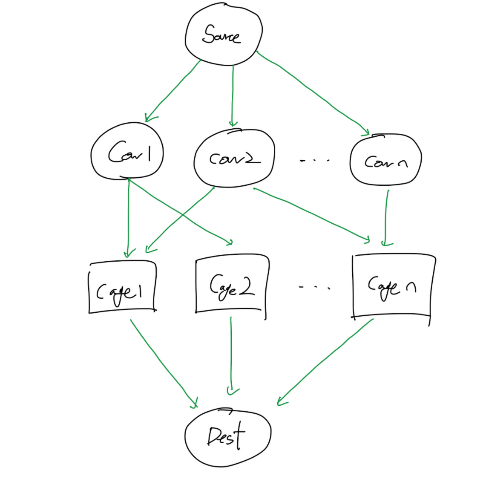

https://www.acmicpc.net/problem/1658
### 문제 풀이
- 소의수 N,축사의수 M M(1≤M,N≤200)
- N개의 줄에는 각 소가 들어가기 원하는 축사에 대한 정보가 주어진다. 
- i번째 소가 들어가기 원하는 축사의 수 Si (0 ≤ Si ≤ M)이 먼저 주어지고, 이후 Si개의 축사 번호가 주어진다. 같은 축사 번호가 두 번 이상 주어지는 경우는 없다.
- 첫째 줄에 축사에 들어갈 수 있는 소의 최댓값을 출력한다.

#### 순서
- 포드-폴커슨 알고리즘을 사용하여 해결할수 있다.

- 그림과 같이 Source를 시작으로 Cow로 가는 간선이 있다고하자.
- Cow는 선호하는 Cage로 가는 간선을 그릴 수 있다. 하지만 유량은 모두 1로 두고
- 결국에는 하나의 Cage를 선택해야한다
- 이 경우에서 보았을때, 가장 많은 유량이 들어올 경우가 정답이다.

 -  네트워크 플로우에서는 양 방향으로 연결되면 안된다.
 - 시간복잡도: 정점 곱하기 간선의 제곱 -> O(V*E^2)