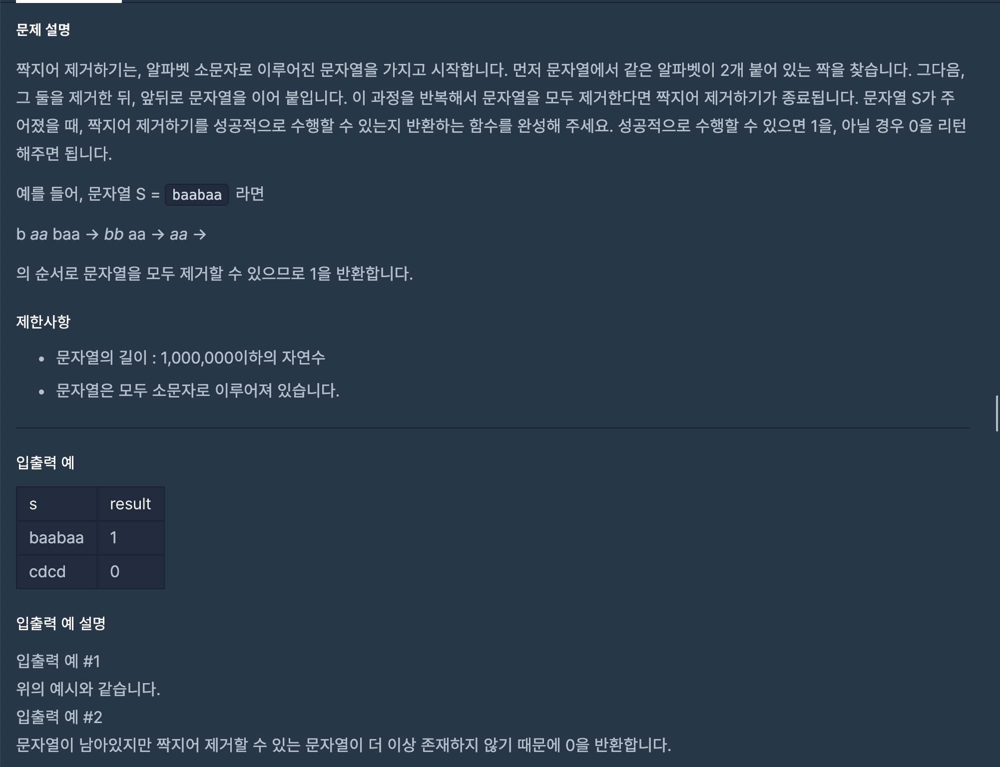

https://programmers.co.kr/learn/courses/30/lessons/12973

### 문제 설명

### 문제 풀이

- 문자열의 길이 : 1,000,000이하의 자연수 이기에 2차원 배열은 불가능하다.
- **알파벳이 2개가 붙어 있다**는 조건을 사용해야한다.
  - stack에 넣어서 마지막 값이랑 비교하는 방향으로 문제를 해결해야한다.

1. s 길이 만큼 탐색한다.

   - 스택(배열)이 비어 있으면 현재 문자 넣는다.
   - 비어있지 않으면, 현재 값이랑 스택의 마지막 값을 비교한다.
     - 만일 같다면 스택(배열)의 마지막 값을 pop한다.
     - 다르다면 push한다.

2. 스택의 길이가 0 이면 성공 1 이상이면 실패로 반환한다.

> 틀린 이유:
> 스택을 활용할 생각을 아예 하지 못했다. 계속 겹치는 부분을 모두 한번에 지우고 s의 길이 만큼 반복하면 해결 될 것이라 판단했다.
> 또한 ,문자열을 slice하는 것이 시간 복잡도의 원인이라고 파악해 이를 해결하는 데 몰두 했다.
