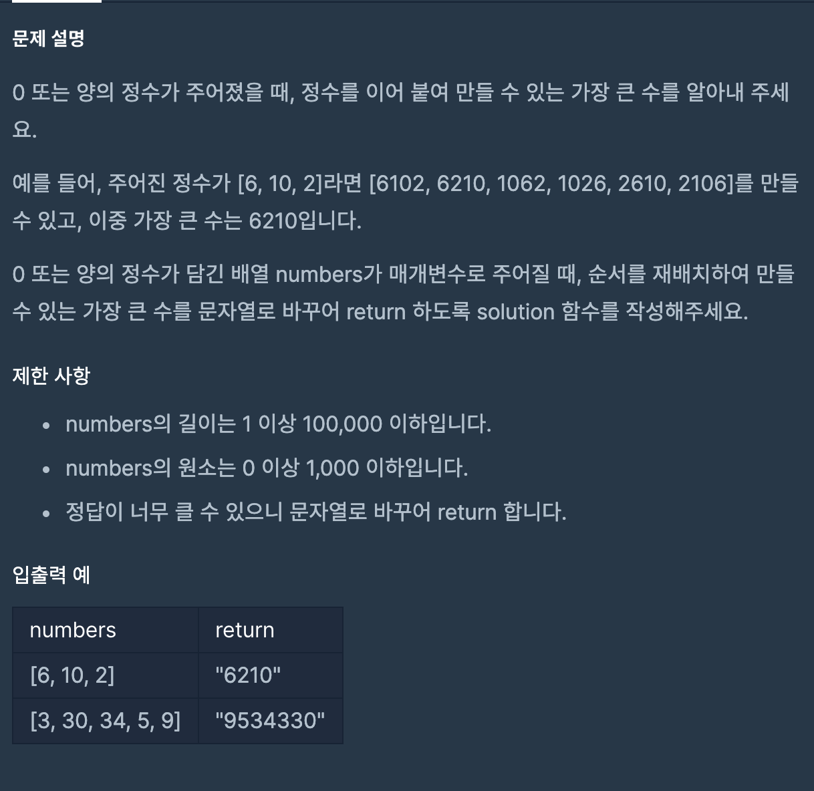

https://programmers.co.kr/learn/courses/30/lessons/42746?language=javascript

### 문제

### 문제 풀이

- numbers의 길이 때문에 이중 포문으로 해결 할 수 없다.
- 따라서 정렬 방식을 사용한다. - 정렬 전에 문자열로 변환하여 합쳤을때 큰것 순으로 정렬한다.
  > js의 경우 정렬시 0,-1,1을 구분해줘야한다.

### 순서

- 모든 숫자를 문자열로 변환하여 배열에 삽입한다.
- 숫자를 정렬한다.
  - 비교 시에 더했을 때(문자열을 합쳤을 시에) 더 큰 숫자를 기준으로 정렬한다.
  - ex. return (a+b)> (b+a)
- 숫자를 출력한다.
  - 0일 경우 0 리턴
  - 그외의 경우 문자열 리턴
